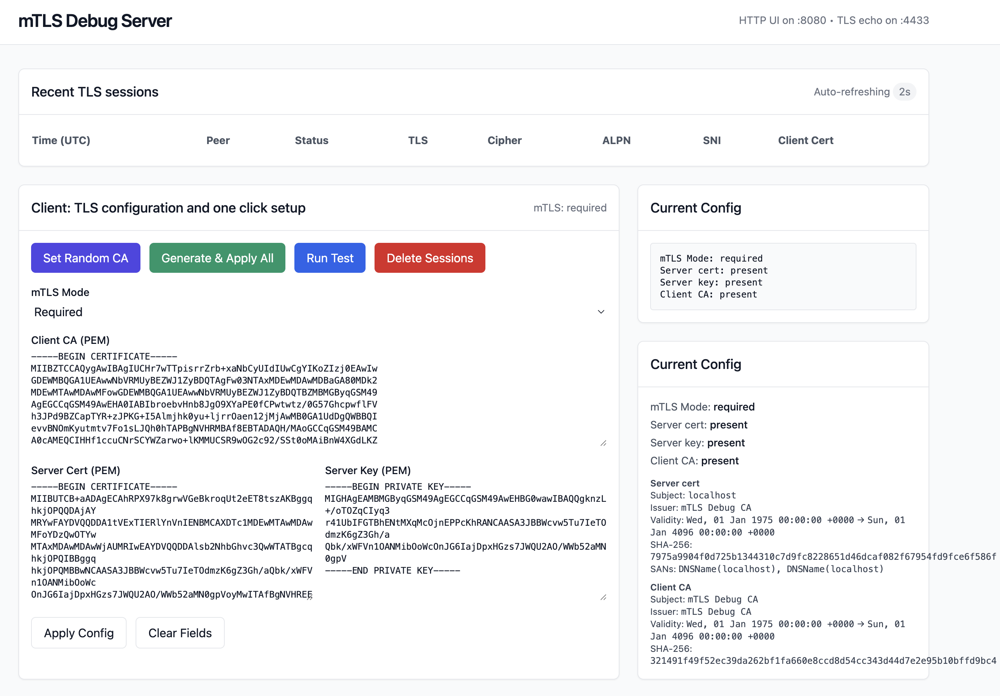

# mTLS Debug Server

A simple TLS echo server built in Rust for debugging mTLS (mutual TLS) connections. It captures detailed handshake information, ClientHello details, and application data payloads for analysis.

## Features

- **TLS Echo Server**: Listens on port 4433 for TLS connections and echoes back any data sent.
- **mTLS Support**: Configurable to require, optional, or disable client certificates.
- **Detailed Diagnostics**: Captures negotiated TLS version, cipher suites, ALPN, SNI, handshake I/O bytes, and more.
- **ClientHello Parsing**: Extracts offered versions, cipher suites, signature algorithms, supported groups, etc.
- **Payload Capture**: Records raw initial bytes and application data (up to 64KB) in hex for forensic analysis.
- **Non-TLS Detection**: Identifies and logs non-TLS traffic (e.g., plain HTTP) on the TLS port.
- **Web UI**: Simple HTML interface on port 8080 for configuration, testing, and viewing sessions.
- **Persistence**: Stores recent sessions in SQLite (top 10 retained).
- **Auto-Loading**: Loads previous TLS config from `./certs` on startup.
- **One-Click Setup**: Generate test certificates and apply configurations easily.

## Quick Start

1. **Build and Run**:
   ```bash
   cargo build --release
   ./target/release/mtls-debug-server
   ```

2. **Access UI**: Open http://localhost:8080 in your browser.

3. **Configure TLS**:
   - Click "Generate & Apply All" to create test certificates (saved in `./certs`).
   - Or set a random CA with "Set Random CA".

4. **Test Connection**:
   - Use the built-in "Run Test" button.
   - Or connect with a TLS client (e.g., Node.js, OpenSSL).

5. **View Sessions**: Recent connections appear at the top; click a row for details.

## Screenshots


*(Add a screenshot of the web UI here by replacing image.png)*

## API Endpoints

- `GET /`: Web UI
- `GET /api/config`: Current TLS config
- `POST /api/config`: Update config
- `POST /api/generate`: Generate and apply test certs
- `POST /api/random-ca`: Set random CA
- `GET /api/sessions`: List recent sessions
- `DELETE /api/sessions`: Clear session history
- `GET /api/certs`: Prefill UI from `./certs`
- `POST /api/test`: Run built-in test client

## Configuration

- **mTLS Modes**: Off, Optional, Required
- **Certificates**: Server cert/key, Client CA
- **Files**: Generated PEMs saved in `./certs/`

## Building from Source

Requires Rust 1.70+.

```bash
git clone <repo-url>
cd ssl_test
cargo build --release
```

## Usage Examples

### Node.js Client
```javascript
const tls = require('tls');
const fs = require('fs');

const socket = tls.connect({
  host: '127.0.0.1',
  port: 4433,
  servername: 'localhost',
  ca: fs.readFileSync('./certs/ca.pem'),
  cert: fs.readFileSync('./certs/client.crt'), // if mTLS required
  key: fs.readFileSync('./certs/client.key'),
}, () => {
  socket.write('ping');
});

socket.on('data', (d) => console.log('echo:', d.toString()));
socket.on('error', console.error);
```

### OpenSSL Test
```bash
openssl s_client -connect 127.0.0.1:4433 -servername localhost -CAfile ./certs/ca.pem -cert ./certs/client.crt -key ./certs/client.key
```

## License

MIT License
